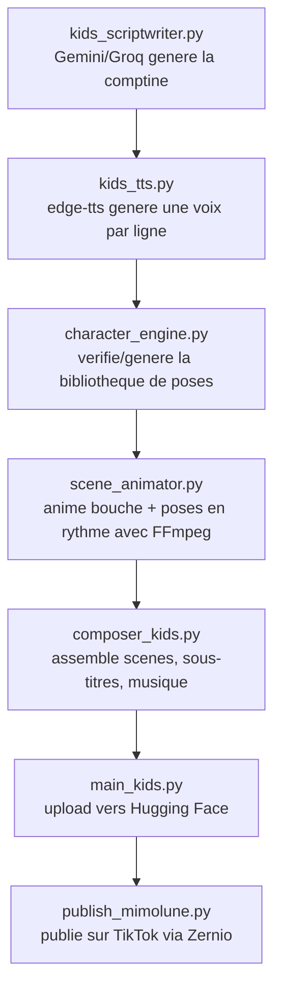

# Architecture technique — Chaîne Mimolune

> Ce document décrit l'architecture du pipeline de génération automatisée de comptines animées pour la chaîne TikTok Mimolune. Il est écrit pour qu'un développeur qui n'a pas participé à la conception initiale puisse reprendre, maintenir et faire évoluer le projet.

---

## 1. Contexte et objectifs

Mimolune est la deuxième chaîne du dépôt `AI-Youtube-Shorts-Generator`, aux côtés de Minute Mystère. Elle publie des comptines et chansons pour enfants avec un personnage récurrent (Mimolune) et des éléments secondaires animés (fruits, décor).

**Contraintes de départ :**
- Budget : 0 € (aucun service payant, aucune carte bancaire à fournir).
- Automatisation : 100% cloud via GitHub Actions, comme la chaîne Minute Mystère. Aucune machine locale ne doit tourner en permanence.
- Qualité visuelle attendue : comparable aux chaînes de comptines qui performent aujourd'hui sur TikTok (Grisou Kids, Bébénou TV, heykids.fr) — personnage cohérent, couleurs vives, rythme soutenu. Pas besoin d'une animation cinéma fluide.

## 2. Décisions techniques et pourquoi

| Sujet | Décision retenue | Alternative envisagée | Pourquoi elle a été écartée |
|---|---|---|---|
| Animation du personnage qui parle | Alternance de 3 formes de bouche pilotées par l'amplitude audio (FFmpeg) | Lip-sync IA (SadTalker / Wav2Lip) | Ces modèles sont entraînés sur des visages humains réels ; sur un personnage illustré, ils produisent souvent des déformations. Ils exigent aussi un GPU pour être rapides. |
| GPU pour l'IA | Aucun GPU utilisé | Google Colab en arrière-plan | Colab gratuit se met en veille après ~90 min d'inactivité, n'a pas d'API de déclenchement planifié fiable, et un usage automatisé répété risque une restriction du compte. Incompatible avec une publication quotidienne fiable. |
| Danse du personnage | Alternance de 4 poses fixes (repos, bras levés, saut asymétrique, étoile) au rythme de la musique | Animation squelette 2D (Live2D, Character Animator) | Demande un rig professionnel et un logiciel dédié, incompatible avec un pipeline 100% scripté et gratuit. |
| Génération d'images | Réutilisation du module existant `modules/ai_image.py` (Pollinations.ai, gratuit, sans clé) | Midjourney / DALL-E | Ces services sont payants ou nécessitent une clé API avec quota limité. |
| Cohérence visuelle du personnage | Génération de la bibliothèque de poses **une seule fois**, stockée sur un dataset Hugging Face, puis réutilisée pour toutes les vidéos futures | Régénérer le personnage à chaque run | Les générateurs d'images gratuits ne garantissent pas un personnage identique d'une génération à l'autre. Fixer la bibliothèque une fois for all supprime ce risque. |
| Synchro pose/musique (v1) | Changement de pose à intervalle fixe | Détection de BPM (tempo) | Plus simple et plus robuste pour une première version. Évolution possible en v2 (voir §10). |

## 3. Vue d'ensemble du pipeline



Ce pipeline tourne en deux workflows GitHub Actions séparés, exactement comme pour Minute Mystère :
- `mimolune_generator.yml` produit une vidéo et l'envoie sur Hugging Face.
- `mimolune_publisher.yml` publie la dernière vidéo du jour sur TikTok.

## 4. Structure des fichiers

Les nouveaux fichiers s'ajoutent au dépôt existant, au même niveau que ceux de Minute Mystère (pas de dossier séparé, pour rester cohérent avec la convention actuelle du repo) :

```text
AI-Youtube-Shorts-Generator/
├── modules/
│   ├── brain.py                  # existant (Minute Mystère)
│   ├── audio.py                  # existant
│   ├── ai_image.py               # existant, réutilisé tel quel
│   ├── asset_manager.py          # existant
│   ├── composer.py               # existant
│   ├── kids_scriptwriter.py      # nouveau
│   ├── kids_tts.py               # nouveau
│   ├── character_engine.py       # nouveau
│   ├── scene_animator.py         # nouveau
│   └── composer_kids.py          # nouveau
├── assets/
│   └── mimolune/                 # cache local des poses téléchargées depuis HF
├── main.py                       # existant (Minute Mystère)
├── main_kids.py                  # nouveau — orchestrateur Mimolune
├── publish.py                    # existant
├── publish_mimolune.py           # nouveau
├── constants.py                  # existant
├── constants_mimolune.py         # nouveau — URLs du dataset Mimolune
├── requirements.txt               # existant, inchangé
└── .github/workflows/
    ├── generator_video.yml        # existant
    ├── tiktok_bot.yml              # existant
    ├── mimolune_generator.yml      # nouveau
    └── mimolune_publisher.yml      # nouveau
```

Aucun fichier existant n'est modifié : la chaîne Minute Mystère continue de fonctionner sans aucun risque de régression.

## 5. Modèle de données — le script d'une comptine

`kids_scriptwriter.py` produit un objet JSON avec cette forme :

```json
{
  "theme": "Les couleurs de l'arc-en-ciel",
  "scenes": [
    {
      "id": 1,
      "speaker": "mimolune",
      "text": "Bonjour les amis, aujourd'hui c'est très joli !",
      "background": "cheerful meadow, pastel colors, kids illustration style",
      "action": "dance"
    },
    {
      "id": 2,
      "speaker": "fruit_fraise",
      "text": "Regarde comme je suis rouge et sucrée !",
      "background": "sunny garden, kids illustration style",
      "action": "wave"
    }
  ]
}
```

- `speaker` détermine quelle voix (`kids_tts.py`) et quelle bibliothèque de poses (`character_engine.py`) utiliser pour la scène.
- `action` détermine le rythme d'alternance des poses (`dance` = changement rapide, `wave`/`talk` = changement lent).
- `background` est un prompt en anglais pour `ai_image.py`, comme pour Minute Mystère.

## 6. Détail des modules

### `modules/character_engine.py`
Responsable de la cohérence visuelle. Au démarrage :
1. Vérifie si la bibliothèque de poses existe déjà sur le dataset Hugging Face `soradata/MimoluneAssets`.
2. Si oui, la télécharge dans `assets/mimolune/`.
3. Si non (premier lancement uniquement), génère les poses via `ai_image.py` avec un prompt et une graine (`seed`) fixes par personnage, puis les envoie sur le dataset pour que tous les runs futurs les réutilisent.

Chaque personnage (`mimolune`, `fruit_fraise`, etc.) possède 4 poses (`repos`, `bras_leves`, `saut`, `etoile`) et 3 formes de bouche (`fermee`, `mi_ouverte`, `ouverte`) superposables.

### `modules/kids_tts.py`
Reprend la structure de `audio.py` mais avec deux voix `edge-tts` distinctes : une voix chaleureuse pour Mimolune, une voix plus aiguë pour les fruits. Calcule aussi l'amplitude audio de chaque ligne (via `librosa` ou une analyse simple des échantillons) pour piloter l'alternance des bouches.

### `modules/scene_animator.py`
Pour chaque scène : superpose la bonne forme de bouche sur la bonne pose de corps à intervalle régulier, en boucle sur la durée de la scène, avec un léger effet de zoom (`zoompan`, comme dans `composer.py`).

### `modules/composer_kids.py`
Reprend `Composer` (héritage) pour profiter de `concatenate_with_transitions` et `_merge_two_clips` tels quels. Ajoute une méthode dédiée pour composer chaque scène (fond + personnage animé + sous-titres).

### `main_kids.py` / `publish_mimolune.py`
Suivent exactement la structure de `main.py` / `publish.py`, avec un dataset Hugging Face séparé (`soradata/MimoluneVideos`) et un compte TikTok séparé.

## 7. Secrets et variables d'environnement à ajouter

En plus des secrets déjà en place pour Minute Mystère :

| Secret | Rôle |
|---|---|
| `TIKTOK_ACCOUNT_ID_MIMOLUNE` | Compte TikTok cible pour `publish_mimolune.py` |
| `KIDS_THEME` (optionnel, variable d'entrée du workflow) | Thème de la comptine du jour |

Les secrets `GEMINI_API_KEY`, `GROQ_API_KEY`, `HF_TOKEN` et `ZERNIO_API_KEY` sont déjà configurés et réutilisés tels quels.

## 8. Feuille de route (évolutions futures)

1. **v1 (livraison actuelle)** : rythme fixe pour l'alternance des poses, bibliothèque de 2 personnages (Mimolune + 1 fruit).
2. **v2** : détection du tempo (BPM) de la musique pour caler les poses sur le rythme réel.
3. **v3, si le budget évolue** : remplacer `scene_animator.py` par un appel à une API de lip-sync GPU serverless payante (Replicate, RunPod) pour un rendu plus réaliste, sans toucher au reste du pipeline — c'est précisément pour permettre ce genre de bascule que `composer_kids.py` reçoit un chemin de clip animé en entrée plutôt que de connaître les détails de sa génération.

## 9. Dépannage

**La vidéo montre toujours la même pose.** Vérifie que `character_engine.py` a bien trouvé plusieurs poses dans `assets/mimolune/` — un problème de téléchargement depuis Hugging Face fait retomber sur une pose unique par sécurité.

**Le personnage change complètement d'apparence d'une vidéo à l'autre.** Signe que la bibliothèque de poses a été régénérée au lieu d'être réutilisée depuis Hugging Face — vérifier `HF_TOKEN` et le nom du dataset dans `constants_mimolune.py`.

**Erreur 409 lors de la publication.** Comportement normal, identique à Minute Mystère : Zernio bloque les doublons publiés dans les dernières 24h.