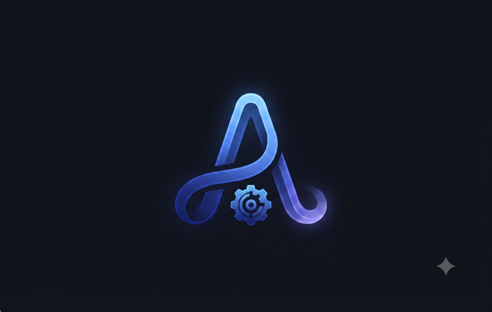

<p align="center">
  
</p>

<h1 align="center">🎬 AuraContent</h1>

<p align="center">
  <strong>Générateur et diffuseur automatisé de vidéos faceless</strong>
</p>

<p align="center">
  Créez, montez, stockez et publiez automatiquement des vidéos courtes à partir d’un simple sujet.
</p>

<p align="center">
  
</p>

<p align="center">
  
  
  
  
  
</p>

---

## 📌 Sommaire

- [Présentation](#-présentation)
- [Fonctionnalités](#-fonctionnalités)
- [Architecture du pipeline](#-architecture-du-pipeline)
- [Structure du projet](#-structure-du-projet)
- [Prérequis](#-prérequis)
- [Configuration des secrets](#-configuration-des-secrets)
- [Installation avec GitHub Actions](#-installation-avec-github-actions)
- [Exécution locale](#-exécution-locale)
- [Planification automatique](#-planification-automatique)
- [Module de publication](#-module-de-publication)
- [Dépannage](#-dépannage)
- [Bonnes pratiques de sécurité](#-bonnes-pratiques-de-sécurité)
- [Licence](#-licence)

---

## 🚀 Présentation

**AuraContent** est un pipeline Python conçu pour automatiser la création et la publication de vidéos courtes de type **YouTube Shorts** ou **TikTok**.

À partir d’un sujet, le pipeline :

1. génère un script avec une intelligence artificielle ;
2. produit une narration audio ;
3. recherche des vidéos stock adaptées ;
4. assemble les différents éléments avec FFmpeg ;
5. stocke la vidéo finale sur Hugging Face ;
6. publie automatiquement la vidéo sur TikTok via l’API Zernio.

L’ensemble du processus peut être exécuté dans le cloud grâce à **GitHub Actions**, sans nécessiter de serveur dédié ni d’ordinateur allumé en permanence.

---

## ✨ Fonctionnalités

| Fonctionnalité | Description |
|---|---|
| ☁️ **Automatisation cloud** | Exécution planifiée avec GitHub Actions, sans infrastructure serveur dédiée. |
| 🧠 **Génération de scripts** | Création de scripts structurés avec Google Gemini ou Groq. |
| 🗣️ **Voix off automatique** | Génération de la narration avec `edge-tts`. |
| 🎞️ **Système Dual-Visual** | Téléchargement de deux vidéos stock distinctes par scène depuis Pexels. |
| ✂️ **Montage automatisé** | Découpage, synchronisation, transitions et composition avec FFmpeg. |
| 🤖 **Avatar de marque** | Insertion aléatoire d’une vidéo avatar dans une scène intermédiaire. |
| 🤗 **Stockage cloud** | Conservation des vidéos générées dans un dataset Hugging Face. |
| 📱 **Publication TikTok** | Publication automatisée via l’API Zernio. |
| 🛡️ **Protection anti-doublon** | Évite de publier plusieurs fois la même vidéo. |
| 🏷️ **Légendes automatiques** | Génération d’un titre et de hashtags à partir du nom de la vidéo. |
| 🤖 **Mention de contenu IA** | Activation du paramètre `video_made_with_ai` lors de la publication. |

---

## 🔄 Architecture du pipeline

```text
Sujet
  │
  ▼
Génération du script
(Gemini ou Groq)
  │
  ▼
Génération de la voix off
(edge-tts)
  │
  ▼
Recherche des vidéos stock
(Pexels)
  │
  ▼
Composition et montage
(FFmpeg)
  │
  ▼
Vidéo finale
  │
  ▼
Stockage cloud
(Hugging Face)
  │
  ▼
Publication automatique
(Zernio → TikTok)
```

### Format narratif utilisé

Les scripts générés suivent généralement une structure courte et adaptée aux vidéos verticales :

```text
Hook → Contexte → Mécanisme → Twist ou conclusion
```

Cette structure permet de capter rapidement l’attention tout en conservant un rythme adapté aux formats courts.

---

## 📂 Structure du projet

```text
AuraContent/
│
├── .github/
│   └── workflows/
│       ├── generator_video.yml
│       └── tiktok_bot.yml
│
├── assets/
│   ├── images/
│   │   └── logo_auracontent.png
│   ├── temp/
│   ├── final/
│   └── avatar/
│       └── avatars.mp4
│
├── modules/
│   ├── brain.py
│   ├── audio.py
│   ├── asset_manager.py
│   └── composer.py
│
├── main.py
├── publish.py
├── constants.py
├── requirements.txt
└── README.md
```

### Rôle des principaux fichiers

| Fichier | Rôle |
|---|---|
| `main.py` | Orchestrateur principal de la génération vidéo. |
| `publish.py` | Recherche et publication de la dernière vidéo générée. |
| `constants.py` | Variables globales, URLs et paramètres du projet. |
| `modules/brain.py` | Génération des scripts avec Gemini ou Groq. |
| `modules/audio.py` | Création de la voix off avec `edge-tts`. |
| `modules/asset_manager.py` | Recherche et téléchargement des vidéos Pexels. |
| `modules/composer.py` | Montage, transitions et composition FFmpeg. |
| `generator_video.yml` | Workflow GitHub Actions dédié à la génération. |
| `tiktok_bot.yml` | Workflow GitHub Actions dédié à la publication. |

---

## 🛠️ Prérequis

### Services requis

Le fonctionnement complet du pipeline nécessite les services suivants :

- Une clé **Google Gemini** ou **Groq** pour générer les scripts.
- Une clé **Pexels** pour télécharger les vidéos stock.
- Un token **Hugging Face** pour stocker et lire les vidéos.
- Une clé **Zernio** pour déclencher les publications TikTok.
- Un **TikTok Account ID** associé à votre compte Zernio.
- Un dépôt GitHub avec **GitHub Actions** activé.

### Installation locale optionnelle

Pour exécuter le projet sur votre ordinateur, installez :

- Python 3.10 ou une version supérieure ;
- FFmpeg ;
- Git ;
- les dépendances Python du fichier `requirements.txt`.

---

## 🔐 Configuration des secrets

Dans votre dépôt GitHub, rendez-vous dans :

```text
Settings
└── Secrets and variables
    └── Actions
```

Ajoutez ensuite les secrets suivants :

| Secret | Description | Obligatoire |
|---|---|---|
| `GEMINI_API_KEY` | Clé API Google Gemini. | Selon le fournisseur utilisé |
| `GROQ_API_KEY` | Clé API Groq. | Selon le fournisseur utilisé |
| `PEXELS_API_KEY` | Clé API Pexels. | Oui |
| `HF_TOKEN` | Token d’accès Hugging Face. | Oui |
| `ZERNIO_API_KEY` | Clé API Zernio. | Oui |
| `TIKTOK_ACCOUNT_ID` | Identifiant du compte TikTok associé. | Oui |

> Si vous utilisez Gemini, renseignez `GEMINI_API_KEY`.  
> Si vous utilisez Groq, renseignez `GROQ_API_KEY`.  
> Il n’est pas nécessaire de configurer les deux fournisseurs en même temps, sauf si votre code prévoit un système de secours.

### Important

Ne placez jamais vos clés API directement dans le code source.

À éviter :

```python
GEMINI_API_KEY = "ma-cle-api"
```

À privilégier :

```python
import os

GEMINI_API_KEY = os.getenv("GEMINI_API_KEY")
```

---

## 🚀 Installation avec GitHub Actions

### 1. Cloner ou forker le dépôt

Forkez le projet ou clonez-le localement :

```bash
git clone https://github.com/<votre-utilisateur>/AuraContent.git
cd AuraContent
```

Si nécessaire, installez les dépendances :

```bash
pip install -r requirements.txt
```

### 2. Ajouter les secrets GitHub

Ajoutez les variables présentées dans la section [Configuration des secrets](#-configuration-des-secrets).

### 3. Ajouter l’avatar

Placez votre vidéo avatar à l’emplacement suivant :

```text
assets/avatar/avatars.mp4
```

Le nom du fichier et la structure des dossiers doivent être respectés exactement.

### 4. Lancer une génération manuelle

Dans votre dépôt GitHub :

1. ouvrez l’onglet **Actions** ;
2. sélectionnez **Générateur de Vidéos IA** ;
3. cliquez sur **Run workflow** ;
4. consultez les logs pour suivre l’exécution.

### 5. Lancer une publication manuelle

Pour publier la dernière vidéo disponible :

1. ouvrez l’onglet **Actions** ;
2. sélectionnez **Bot Auto-Publication TikTok** ;
3. cliquez sur **Run workflow** ;
4. vérifiez le résultat de l’appel à l’API Zernio.

---

## ⏰ Planification automatique

Les workflows sont exécutés automatiquement selon la planification définie dans les fichiers YAML.

| Workflow | Fonction | Horaires indiqués |
|---|---|---|
| `generator_video.yml` | Génération des vidéos | 06:00 et 18:00 UTC |
| `tiktok_bot.yml` | Publication sur TikTok | 12:00 et 19:00 UTC |

Les horaires sont exprimés en **UTC**. Pensez à les convertir selon votre fuseau horaire local.

Pour modifier la fréquence d’exécution, éditez la section `schedule` du workflow concerné :

```yaml
on:
  schedule:
    - cron: "0 6,18 * * *"
```

> Les workflows peuvent également être exécutés manuellement depuis l’onglet **Actions** de GitHub.

---

## 📱 Module de publication

Le fichier `publish.py` automatise la publication des vidéos générées.

### Fonctionnement

1. Connexion au dataset Hugging Face.
2. Recherche des fichiers `.mp4` disponibles.
3. Sélection de la dernière vidéo générée.
4. Extraction d’un titre à partir du nom du fichier.
5. Génération d’une légende avec hashtags.
6. Vérification de l’historique de publication.
7. Envoi de la vidéo à l’API Zernio.
8. Publication sur TikTok avec l’indication de contenu généré par IA.

### Protection contre les doublons

Le module vérifie notamment si une vidéo identique a déjà été publiée récemment.

Lorsque l’API Zernio renvoie une erreur `409 Conflict`, cela signifie généralement que la vidéo a déjà été publiée ou qu’une publication similaire existe déjà. Cette situation est interceptée afin d’éviter la duplication de contenu.

---

## ⚠️ Dépannage

### Erreur `Avatar file missing`

Vérifiez que le fichier existe exactement à cet emplacement :

```text
assets/avatar/avatars.mp4
```

Contrôlez également les points suivants :

- la casse du nom du fichier ;
- l’extension `.mp4` ;
- la présence du fichier dans le dépôt GitHub ;
- l’absence d’une règle `.gitignore` qui empêcherait son envoi.

### Erreur `409 Conflict` lors de la publication

Cette erreur indique généralement que la vidéo a déjà été publiée récemment.

Vérifiez :

- l’historique des publications TikTok ;
- les logs du workflow GitHub Actions ;
- l’identifiant du fichier vidéo envoyé ;
- la logique anti-doublon dans `publish.py`.

### Vidéo noire ou fichier corrompu

Ce problème peut être lié à un codec incompatible ou à des paramètres FFmpeg incorrects.

Essayez les actions suivantes :

- ouvrir la vidéo avec VLC Media Player ;
- vérifier que FFmpeg est correctement installé ;
- contrôler la résolution et le format de sortie ;
- utiliser le pixel format `yuv420p` ;
- vérifier que les fichiers source téléchargés depuis Pexels sont valides.

Exemple de paramètre FFmpeg recommandé :

```bash
-pix_fmt yuv420p
```

### Échec d’un workflow GitHub Actions

Consultez les logs détaillés du workflow et vérifiez :

- que tous les secrets nécessaires sont configurés ;
- que les quotas API ne sont pas dépassés ;
- que les dépendances sont installées ;
- que FFmpeg est disponible dans l’environnement GitHub Actions ;
- que les permissions du workflow sont suffisantes ;
- que les fichiers temporaires sont correctement générés.

---

## 🧪 Exécution locale

Pour tester la génération sur votre ordinateur, configurez d’abord les variables d’environnement :

```bash
export GEMINI_API_KEY="votre-cle"
export PEXELS_API_KEY="votre-cle"
export HF_TOKEN="votre-token"
```

Puis lancez le générateur :

```bash
python main.py
```

Pour tester le module de publication :

```bash
python publish.py
```

Sous Windows PowerShell :

```powershell
$env:GEMINI_API_KEY="votre-cle"
$env:PEXELS_API_KEY="votre-cle"
$env:HF_TOKEN="votre-token"
```

---

## 🔒 Bonnes pratiques de sécurité

- Ne commitez jamais de clés API dans le dépôt.
- Utilisez exclusivement les **GitHub Actions Secrets**.
- Limitez les permissions de vos tokens au strict nécessaire.
- Utilisez un dépôt privé si le projet contient des éléments propriétaires.
- Faites régulièrement tourner vos clés API.
- Vérifiez les licences et conditions d’utilisation des contenus téléchargés.
- Respectez les règles de publication et de contenu de TikTok.
- Ajoutez une mention de contenu généré par IA lorsque cela est requis.

---

## 🗺️ Évolutions possibles

Quelques améliorations envisageables :

- ajout d’un tableau de bord de suivi des publications ;
- prise en charge de plusieurs comptes TikTok ;
- génération automatique des sous-titres ;
- sélection des sujets à partir d’un calendrier éditorial ;
- stockage des métadonnées dans une base de données ;
- ajout de tests unitaires et d’intégration ;
- suivi des métriques de performance ;
- intégration de YouTube Shorts et Instagram Reels ;
- ajout d’un système de reprise automatique après échec ;
- versionnement des prompts et des modèles utilisés.

---

## 📜 Licence

Projet open source. Vous êtes libre de l’utiliser, de le modifier et de l’adapter à vos propres besoins, sous réserve du respect des licences des services et ressources externes utilisés.

Construisez, automatisez et développez votre propre système de création de contenu avec **AuraContent**. 🎬
